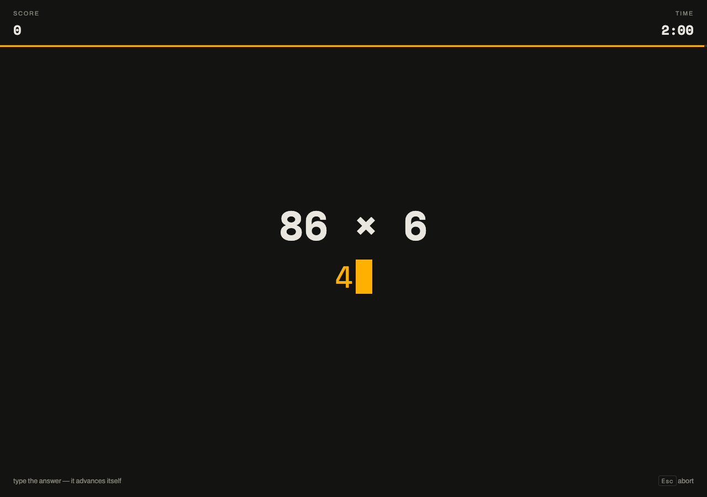
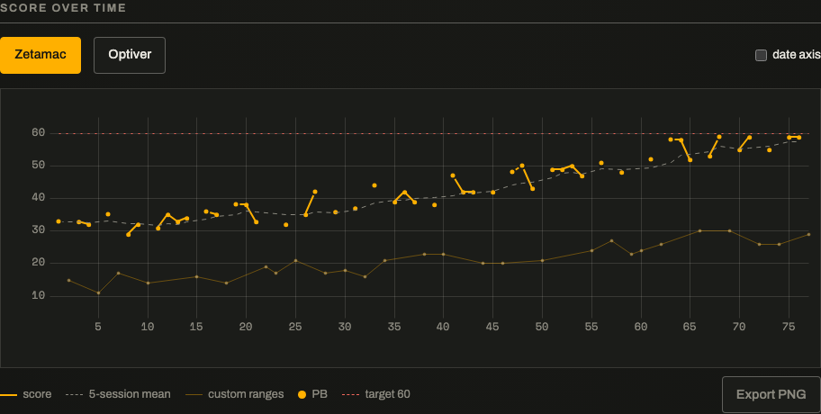

# mental×math

**Live: <https://dario-zela.github.io/mental-math-trainer/>** — local-first, keyboard-only, no accounts.

A mental-math trainer built for trading-interview prep. It drills what
[Zetamac](https://arithmetic.zetamac.com/) doesn't — fractions, decimals,
percentages, reciprocals — simulates the Optiver *80-in-8* under real test
conditions, and schedules questions against the types you get wrong, not the
questions you've seen.



## Training curve



*Currently showing the bundled demo data (12 synthetic weeks) — the chart comes
straight out of the app's PNG export, and this image gets replaced with my real
curve as training progresses. The faint series is custom-range sessions, kept
off the benchmark line so it stays honestly comparable to community Zetamac
scores. Numbers from buckets with fewer than 10 attempts are never quoted —
the heatmap desaturates them.*

## Modes

| Mode | Rules |
|---|---|
| **Zetamac sprint** | 120s, +1 per correct, auto-advance on the correct keystroke sequence — locked to Zetamac's default ranges so scores calibrate against community numbers. Custom ranges are allowed but labelled and plotted separately. |
| **Optiver 80-in-8** | 8 minutes, 80 questions, +1/−1, explicit Enter, skip scores 0. A *simulation*, not just a scorer: 3-2-1 pre-roll, no per-question feedback, running score hidden until the end, focus losses recorded, Esc discards. A review pass afterwards steps through every question. **The question mix is locked and researched against candidate accounts of the real test** — 2–3-digit add/sub, times-table and 2×2-digit mults, 2-digit-divisor division, decimal ± / × / ÷, small-denominator fractions, and missing-operand questions (66 × ? = 138.6), sampled uniformly. No percentages or reciprocals: no account of the real test mentions them. Fixed content + uniform sampling is what makes sim PBs comparable over time and to the real thing. |
| **Fermi sprint** | 120s of unwieldy estimation (48,213 × 677; 23% of 6,834,000) graded at ±5% relative error — the trading-interview skill the exact modes can't drill. Enter-commit only: auto-advance on a tolerance band would fire on lucky prefixes. |
| **Focus drill** | Untimed, one question type, per-question millisecond timings — deliberate practice. |

## The differentiating feature: weakness-driven scheduling

The SRS unit is the **question type** (`op:operandClass` — e.g. `mul:2x2`), not
the question instance. Memorising 47×83 is useless; being slow at 2×2
multiplication is the signal.

- Per bucket, exponentially-decayed records: `errRate ← 0.9·errRate + 0.1·miss`,
  same for mean answer time.
- Weakness `w = errRate + 0.5·clamp(meanMs/targetMs − 1, 0, 1)` — slow-but-right
  still counts as weak. Targets are a hand-set table, deliberately not learned.
- Sampling ∝ `(0.2 + w)²`, with a floor keeping every enabled bucket in rotation
  and a 30%-per-session cap so your worst bucket can't become a demoralising
  monoculture (which would also starve every other bucket's estimate of fresh data).
- **No SM-2/Anki intervals.** Interval scheduling models day-scale forgetting;
  drill sessions are minutes apart. Decayed error rates are the honest model here.
- Skips count as misses but contribute no time signal — there's no answer time to
  learn from, and skipping under +1/−1 rules is exactly the "can't do this fast"
  signal the model wants.

## Sessions are `(seed, config)` pairs

Every session is a pure function of its seed and config, so any session is
**replayable and shareable as a URL** — challenge links, bug repros and demo
links all fall out of one codec for free (hash-routed, so static hosting needs
no rewrite rules).

The subtle part: the scheduler samples from *your* stats, which would make the
same link produce different questions on your friend's machine. So the sampling
weights are **snapshotted at session start, quantised to 4 bits each, and
encoded into the config** — the receiver replays your exact session, weakness
mix included. Cold start falls out naturally as an all-zero snapshot (uniform),
and the Zetamac benchmark pins the snapshot to uniform, matching how Zetamac
itself samples ops. Replays update your weakness model (the SRS unit is the
type, not the instance) but are excluded from PBs and streaks.

## Answers are exact rationals

`0.375`, `.375`, `3/8` and `6/16` all match ⅜ by exact rational equality — no
float comparison, no tolerance grading anywhere in v1. One generator invariant
kills the entire "was 0.33 close enough?" class of design questions: every
answer is an integer, a small fraction, or a terminating decimal.
Unsimplified fractions are accepted deliberately — the skill being drilled is
arithmetic, not simplification.

Two post-v1 stretch buckets relax this *by explicit, per-bucket contract* —
repeating reciprocals grade to 3 significant figures and Fermi questions to
±5% relative error — and even those tolerances are computed in integer
arithmetic, never float comparison. Exact-graded buckets are untouched, and
the tolerance modes can't leak into them by construction (they're separate
`grading` values pinned by property tests).

The input grammar is frozen (`int | decimal | fraction`, filtered at keystroke
level) and pinned down by a table of accept/reject test rows, not prose.
Auto-advance inherits Zetamac's prefix quirk — answer 12 fires while you're
typing 123 — kept deliberately, because that's what the benchmark does.

## Honest timing

- The per-question clock starts at prompt **paint** (`performance.now()` in a
  rAF after the question commits), not at state change — render time is
  excluded from your number.
- First-keystroke and submit times come from `event.timeStamp`; the
  think-time/typing-time split is usually the whole story of where seconds go
  (see the stats screen).
- Times are clamped at 20s before entering any average — one phone distraction
  can't wreck a bucket. Focus losses void the timing of untimed questions; in
  timed modes the wall clock keeps running, as in the real test.
- The countdown derives from `performance.now()` deltas on a 100ms tick — no
  accumulated `setInterval` drift across an 8-minute sim.
- The hot input handler is wrapped in `performance.mark`; the measured maximum
  is printed on every results screen (budget: 16ms — it measures ~1ms).

## Architecture

```
src/
├── core/     seeded RNG, generators, rational arithmetic, weakness model,
│             scheduler, scorers, session machine, URL codec — pure TypeScript,
│             zero DOM imports, fully unit/property-tested
├── store/    versioned localStorage schema + migrations, export/import
└── ui/       React (Vite) — components only; timing capture and keyboard
              plumbing, no domain logic
```

The real design point: **the framework is replaceable because the core doesn't
import it.** React is the thin shell; every rule in this README lives in `core/`
and runs headless under vitest.

Persistence is a single versioned localStorage blob with an explicit migration
chain. Corrupt or fuzzed payloads always yield a working fresh store (property-
tested), and every 10th session nudges an export — Safari can evict localStorage,
so the worst case is bounded at "some stats", never the app (it's a static PWA,
offline-capable).

## Testing

- **Property tests** (fast-check): every generated answer verifies against an
  independent prompt evaluator; operands respect class ranges; the
  representability invariant holds; div answers are integers; sub never negative.
- **Equivalence table**: accept/reject rows for the frozen grammar, including
  the auto-advance prefix-fire cases.
- **Scheduler distribution**: 10k draws vs `(base+w)²` weights under chi-squared;
  monotonicity (higher error ⇒ more samples); cold-start uniformity; the session
  cap and floor.
- **Determinism golden**: same `(seed, config)` ⇒ byte-identical question
  sequence, pinned by snapshot; the URL codec round-trips arbitrary configs.
- **Store fuzzing**: arbitrary corrupt payloads never crash and always salvage.
- **Playwright**: a full keyboard-only session through a challenge URL,
  persistence across reload, and axe scans of all three screens (0 serious
  violations).

## Coach mode & the Learn screen

The trainer doesn't just measure — it teaches. **Learn** is a catalogue of 32
mental-math techniques (compensation, split-and-distribute, difference of
squares, squares ending in 5, the Vedic near-100 base method, same-tens pairs,
double-and-halve, ÷5-as-×2, fraction cross-cancelling, 10%-building-blocks,
the eighths family, halving chains, divisibility rules…), each with a worked
example and a mastery state (new → practising → mastered) derived from your
actual bucket stats. One key launches a practice drill on that technique's
bucket.

**Coach mode** (focus drills only — assessments stay hint-free): a wrong
answer pauses on the worked solution *of the question you just missed*, chosen
by an operand-aware dispatcher — `explain()` in the framework-free core picks
the best trick for the concrete numbers (47×53 gets difference-of-squares,
47×43 gets the same-tens rule, 86×5 gets ×10-halved) and shows the actual
steps. Pressing `h` surrenders a question to see it solved — scored as a skip,
so the weakness model stays honest. The review pass shows the worked solution
for every question in every mode.

The explainer is property-tested: every generatable question in every bucket
gets a worked solution whose final step lands on the canonical answer (fermi
excepted — its steps are estimates by design).

## Profiles

Bucket selection is one click, not two dozen checkboxes: **Starter** (the
gentle end of every family — the fresh-install default), **Core four**,
**Fractions & decimals**, **Percentages**, **Interview mix** (the hard end of
everything), and **Everything**. Switchable from the home screen or Settings;
the checkboxes remain for fine-tuning, and a hand-tuned selection just shows
as "Custom".

## Deliberate calls, documented

- Reciprocal questions reject the `/` key — typing the prompt back would
  trivially match under rational equality.
- Skip is Enter-on-empty (the spec's "0 to skip" collides with answers
  containing 0).
- Zetamac-parity mode has no skip and no wrong-submit, because Zetamac has
  neither; the time you lose *is* the penalty.
- The Optiver sim's content is evidence-based, not settings-based: prep guides
  and candidate accounts consistently describe 2–3-digit arithmetic, decimal
  operations, small fractions and missing-operand questions — and never
  percentages — so that's exactly what the sim asks, uniformly sampled.
  Weakness-weighting and difficulty annealing are practice devices; they never
  touch an assessment.
- PBs exist only for the fixed-configuration modes — the benchmark sprint, the
  Optiver sim, and the Fermi sprint — because custom-range scores aren't
  comparable across configs.
- End-of-session results are announced via `aria-live`; per-question
  announcements would fight the drill pace.
- No accounts, no sync, no backend — a backend would double the build for zero
  interview value. Same-seed challenge links give 90% of head-to-head for 0% of
  the cost.

## Stretch goals, shipped

Everything on the design doc's stretch list except the explicitly-rejected
WebRTC head-to-head:

- **Repeating-decimal reciprocals** (`recip:rep`: 1/3, 1/7, …) with 3-s.f.
  grading — accepts both the rounded and truncated form (0.143 and 0.142 for 1/7).
- **Fermi estimation mode** — see the modes table; its buckets live outside the
  exact-graded universe entirely.
- **Within-bucket adaptive difficulty** — operand ceilings anneal toward your
  edge (fast-and-right +0.02, miss −0.03, slow-but-right −0.01, clamped to the
  class range). Fresh buckets start gentle (0.2, the bottom half of the class
  range) and calibrate at double speed for the first 25 attempts, so the first
  minutes of a new type feel winnable while a strong user reaches full ranges
  within ~20 answers. Snapshotted into the share URL like the weights, so
  replays stay byte-identical. **Annealing is a practice device only**: the
  Optiver sim, the Fermi sprint, and Zetamac-parity buckets always run at full
  class ranges — both in `makeConfig` and in the URL codec, so a crafted link
  can't mint an artificially easy "assessment" — otherwise their scores would
  stop corresponding to the real tests' level. Landed as schema v2 via the
  migration chain.
- **Audio feedback** — WebAudio tick/buzz, zero assets. The Optiver sim plays a
  verdict-blind click instead: the real test gives no feedback, so the sound
  must not leak one. Mute toggle in Settings.
- **Full per-question history** in IndexedDB with long-horizon analytics:
  all-time totals and per-bucket weekly mean-time trends, plus a full-history
  JSON export. Best-effort by design — IDB being unavailable degrades to a
  note, never an error.

The codec's bucket universe is append-only (pinned by test), so challenge
links minted before these features decode unchanged — and old links without
the difficulty param replay at full class ranges, exactly as they originally ran.

## Develop

```sh
npm install
npm run dev        # Vite dev server
npm test           # vitest (core + store)
npm run e2e        # Playwright (needs: npx playwright install chromium)
npm run build      # typecheck + production build
node scripts/gen-demo.mjs   # regenerate the bundled demo data
```

CI runs typecheck + unit tests + build + e2e on every push and deploys `dist/`
to GitHub Pages from `main`.
